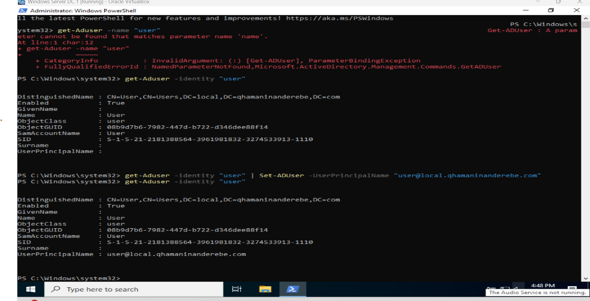
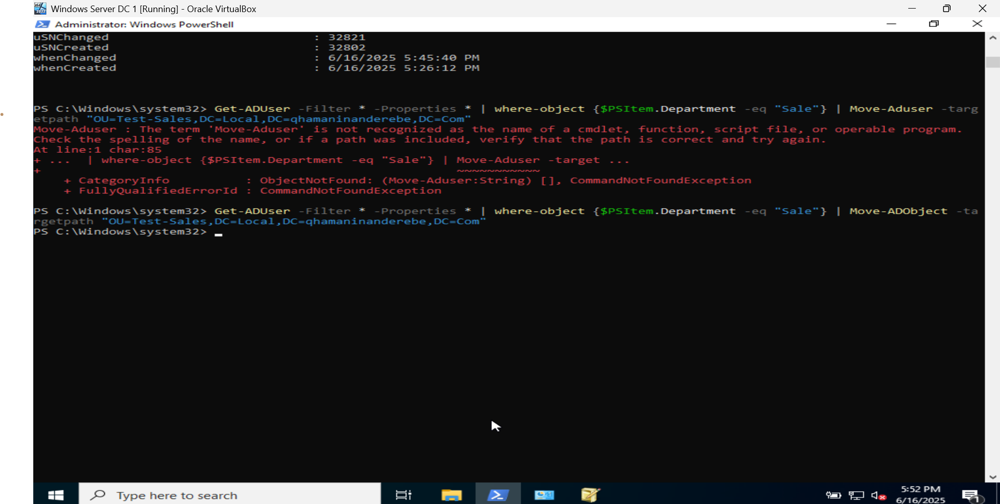
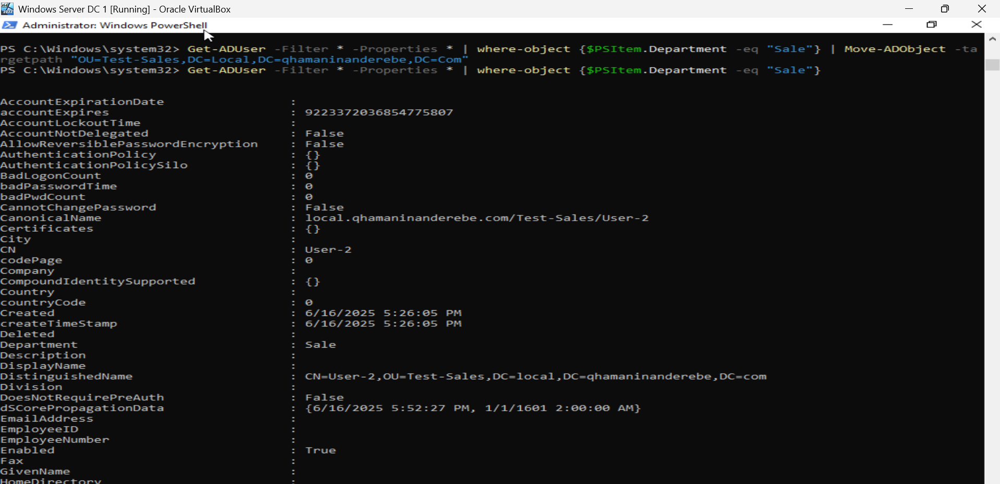

# 🧑‍💼 Active Directory PowerShell User Management

This repo contains PowerShell scripts and practical demonstrations for managing Active Directory (AD) users, built and tested on a local AD environment.

## 🔧 What’s Covered

### 1. Set User Principal Name (UPN) Using a Pipeline
- Retrieve users
- Modify `UserPrincipalName` based on naming standards

### 2. Move Users Between Organizational Units (OUs)
- Use `Move-ADObject` with a clear `-TargetPath`
- Example path: `OU=Test,DC=Local,DC=qhamaninanderebe,DC=com`

### 3. Filter and Retrieve Specific User Properties
- Use `-Filter` and `Where-Object` to get:
  - Department
  - Display name
  - Enabled/Disabled status
- Clean output and property formatting

---

## 📁 Folder Structure

## 🔍 Screenshots

### 🔹 1. Set UserPrincipalName via Pipeline
| Step | Description | Preview |
|------|-------------|---------|
| 1 | Get AD users properties |  |

---

### 🔹 2. Move User to Another OU
| Step | Description | Preview |
|------|-------------|---------|
| 2 | Moving to new OU |  |

---

### 🔹 3. Filter Users by Department
| Step | Description | Preview |
|------|-------------|---------|
| 1 | Get all user properties using `-Filter` |  |
| 2 | Get Properties of users under specific OU  `Where-Object` |  |
| 3 | Displaying selected properties like "Department" |  |

📚 Notes
Tested in a VirtualBox lab with local domain controller.

Scripts are minimal and reusable in enterprise environments.

AD tools must be installed (RSAT: Active Directory Tools).

